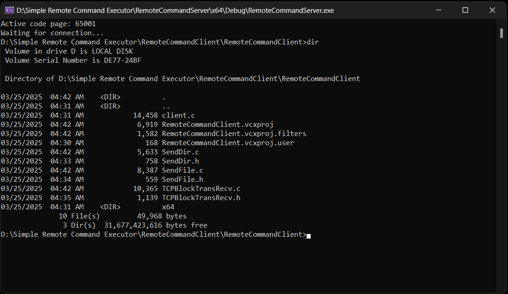
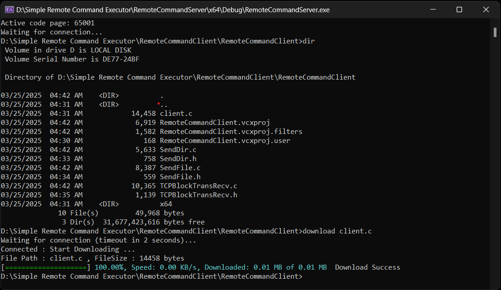
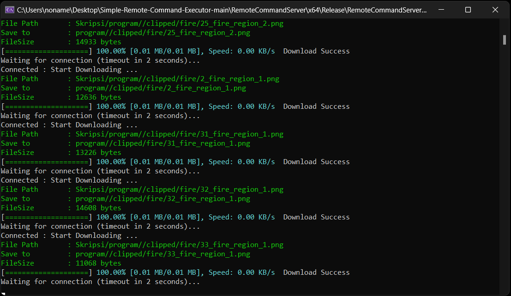

# Simple Remote Command Executor 🚀💻

Welcome to the **Simple Remote Command Executor** project! This project is a remote administration application that allows you to:

### Download Files or Folders 📎➡️💾
The download feature enables you to retrieve files or folders from a remote machine easily.

### Execute Remote Commands ⌨️🖥️
Run CMD commands like `cd`, `cls`, and other commands remotely, allowing you to control the target machine in real-time.

---

## Application Overview 📄

This project consists of two main applications:

### Server
- The server waits for connections from the client, receives commands, and sends execution results or file/folder data to the client.
- It also displays the currently active working path.

### Client
- The client sends commands to the server, receives and displays execution results, and initiates the file/folder download process.

---

## Key Features 🌟

- **File/Folder Download:**  
  Using the command `download <path>`, the server will check the type of the path (file or folder) and initiate the data transfer accordingly.

- **Remote Command Execution:**  
  You can execute any CMD command such as `dir`, `ipconfig`, or other custom commands.  
  The results are sent back to the client and displayed instantly.

- **Stable Connection:**  
  Includes retry and timeout mechanisms to maintain a stable connection between the server and client, even in case of interruptions.

- **Secure Data Transmission with Checksum:** 🔒✅  
  Ensures data integrity through checksum validation during each data transfer.

---

## Screenshots 📸

Below are some example screenshots of the application in action.  

### Basic Command

### Download File

### Download Folder

---

## System Requirements ⚙️

- **Platform:**  
  This application is written using the **Windows API (Winsock)** and can only be run on **Windows**.

- **Compiler:**  
  Use **Visual Studio** or any other C/C++ compiler that supports Windows.

- **Dependencies:**  
  - **Winsock Library** (`ws2_32.lib`)
  - **Shlwapi Library** (`Shlwapi.lib`) – required for the client application.

---

## Compilation Guide 🛠️

### Using Visual Studio 22

1. Open sln file.
2. **Build** each project.

